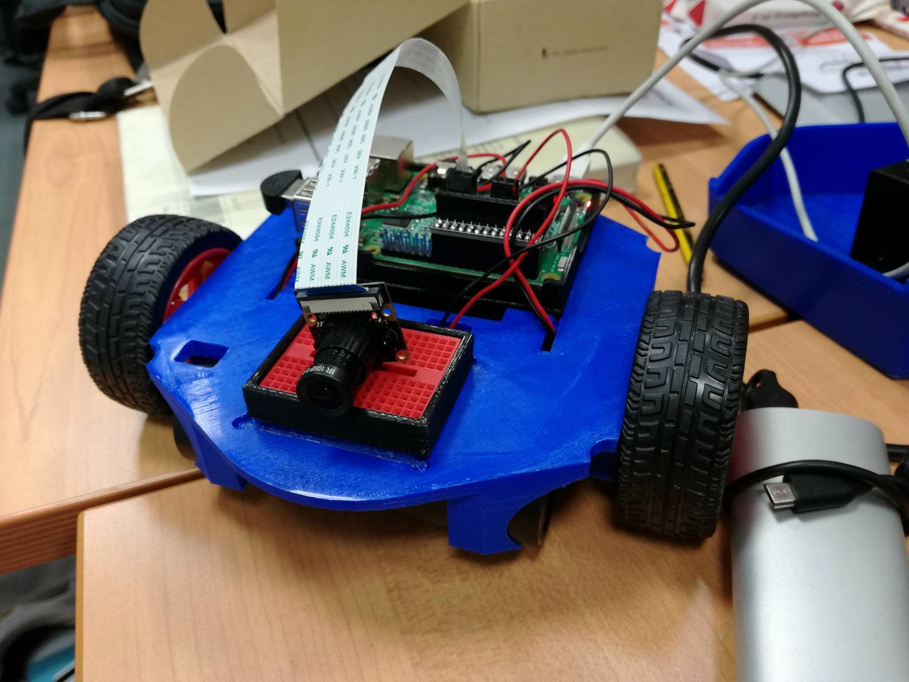

# Tutorial Robot Telepresenza con DotBot

Per telepresenza robotica, si intende la realizzazione di un dispositivo mobile (robotico) in grado di effettuare streaming audio/video. In questo modo, anche se la persona non è presente fisicamente, può comunque visitare un luogo da remoto, osservare l'ambiente circostante e parlare con le persone.

Vi sono numerosi esempi di questo tipo, per citarne uno italiano, si pensi al robot [Virgilio](https://rottasutorino.blogspot.it/2014/11/al-castello-di-racconigi-con-il-robot-virgil.html), usato come guida turistica al castello di Racconigi.

Questo tutorial vi permetterà quindi di usare il vostro DotBot robot per sviluppare un'applicazione simile, comandando il robot direttamente dal vostro PC!

# Cosa serve?

Prima di scendere più in dettaglio con il tutorial, vediamo di cosa avete bisogno per realizzare il progetto:

- un account valido nella piattaforma cloud [HotBlack Robotics](http://www.hotblackrobotics.com/), visto che la useremo per  controllare il robot;
- un robot DotBot;
- un computer con sistema operativo Linux e [ROS](http://www.ros.org/about-ros/) (se non avete ROS installato, date un occhio [qui](http://wiki.ros.org/lunar/Installation)) installato;
- un microfono USB per catturare l'audio, nell'applicazione è stato usato [questo](http://www.dx.com/it/p/mi-305-plug-and-play-mini-usb-microphone-black-287434?tc=EUR&ta=IT&gclid=CjwKCAiAxuTQBRBmEiwAAkFF1gj1-rb-XWtuLdglk_LsqyfjSy71G_tBUA_jhrmmZPaIpSDc1yHg-BoCQXoQAvD_BwE);
- cuffiette jack per testare la configurazione del sistema;
- una [raspicam](https://www.amazon.it/Raspberry-Official-Camera-Module-8Mp/dp/B01ER2SKFS).

Una volta che avete tutto l'occorrente, potete montare il microfono USB e la raspicam nel vostro DotBot. Se avete usato lo stesso microfono linkato sopra, il vostro DotBot avrà questo aspetto:



# Mano al software

Dopo aver montato tutto l'hardware, è il momento di passare alla configurazione del software necessario per far funzionare l'applicazione. Alcuni passaggi potrebbero sembrare un po' complicati, ma non vi preoccupate che tutto verrà spiegato nel dettaglio. 

In questa parte configureremo separatamente prima DotBot e poi il PC.

## DotBot

Per prima cosa, ci occuperemo di configurare DotBot e, in particolare, andremo a installare e settare le librerie necessarie per lo streaming audio. Infatti, per quello che riguarda lo streaming video, useremo una funzionalità offerta dalla piattaforma cloud [HotBlack Robotics](http://www.hotblackrobotics.com/), per cui non ci dovremmo preoccupare di nulla.

Per questa fase, abbiamo bisogno di essere connessi tramite SSH al robot DotBot. Se non sapete come fare, guardate l'indirizzo IP del vostro robot dalla piattaforma HotBlack Robotics, dopodichè digitate nel terminale del vostro PC:

```sh
$ ssh root@[IP del vostro robot]
```

e quando vi verrà chiesta la password, immettete "raspberry". Se tutto è andato a buonfine, sarete così collegati tramite PC al robot DotBot.

### Installare le librerie

Le librerie di cui abbiamo bisogno si chiamano [GStreamer](https://gstreamer.freedesktop.org/) e [ALSA sound](https://www.alsa-project.org/main/index.php/Main_Page). A questo proposito, sono sufficienti i seguenti comandi da terminale per installarle:

```sh
$ sudo apt-get install alsa-utils
$ sudo apt-get install alsamixer
$ sudo apt-get install gstreamer0.10-plugins-base
$ sudo apt-get install gstreamer0.10-plugins-good
$ sudo apt-get install gstreamer0.10-plugins-ugly
$ sudo apt-get install gstreamer0.10-plugins-bad
```

### Specificare ad ALSA l'utilizzo del microfono USB

Una volta installate le librerie, bisogna specificare qual'è il dispositivo hardware che usate per catturare l'audio. In poche parole, bisogna dire dove è collegato il microfono USB. Per fare questo dobbiamo prima vedere come viene effettivamente chiamato il microfono e poi suggerirlo alla libreria ALSA.

Per vedere la lista di dispositivi sonori connessi a DotBot digitate

```sh
$ aplay -L
```
E leggete l'indirizzo hardware relativo al microfono USB come indicato [qua](https://superuser.com/questions/53957/what-do-alsa-devices-like-hw0-0-mean-how-do-i-figure-out-which-to-use).

Dopodichè, bisogna specificare l'indirizzo ad ALSA. Per farlo, basta scrivere un file di configurazione /etc/asound.conf, con il seguente contenuto:

pcm.! default {

:   type plug
slave {
        pcm "hw : 1 , 0 "
    }

}

ctl.! default {
:   type hw
card 1

}

Per scrivere il file è sufficiente digitare i seguenti comandi da terminale:

```sh
$ nano /etc/asound.conf
```

copiare e incollare nella finestra il contenuto del file e poi salvare e chiudere.

### Test audio

Per verificare che tutto sia andato nel verso giusto, riavviate il robot con il comando:

```sh
$ sudo reboot
```

E poi, una volta che il robot è di nuovo pronto, eseguite il seguente test.

Per registrare un suono digitate nel terminale

```sh
$ arecord -D plughw:1,0 -f cd test.wav
```

Per riascoltarlo, inserite le cuffiette nel jack di DotBot e digitate

```sh
$ aplay test.wav
```

Se siete riusciti a registrare e riascoltare l'audio, allora la parte di configurazione del microfono è terminata e siamo pronti per il prossimo step.

### Troubleshooting

Se hai avuto qualche problema con questa parte, prova a visitare i link seguenti che molto probabilmente contengono la risposta alle tue domande:

- http://www.alsa-project.org/main/index.php/Asoundrc
- http://www.linuxcircle.com/2013/05/08/raspberry-pi-microphone-setup-with-usb-sound-card/
- https://superuser.com/questions/53957/what-do-alsa-devices-like-hw0-0-mean-how-do-i-figure-out-which-to-use


### Installare il pacchetto ROS audio_common

Dopo aver configurato propriamente l'audio nel DotBot robot, non rimane che installare il pacchetto [ROS audio_common](http://wiki.ros.org/audio_common) che si occupa di gestire l'audio nella nostra applicazione di telepresenza.

L'installazione è molto semplice ed è dettagliatamente spiegata nel sito ufficiale di ROS, procedete al link seguente per la procedura di installazione: http://wiki.ros.org/audio_common/Tutorials/Streaming%20audio

### Test audio_common

Per verificare che tutto sia stato installato correttamente, si può fare una prova simile a quella fatta precedentemente con arecord e aplay, tuttavia usando il pacchetto ROS common_audio.

A tal proposito, si può seguire il tutorial presente nel link precedente (http://wiki.ros.org/audio_common/Tutorials/Streaming%20audio), che verrà velocemente riassunto di seguito. 

(Se sei completamente nuovo a ROS, devi prima inizializzare il PC e il robot DotBot creando un ambiene di lavoro cat_kin. Non avere paura, è tutto molto semplice e devi solo seguire queste istruzioni http://wiki.ros.org/ROS/Tutorials/InstallingandConfiguringROSEnvironment).

Aprite tre terminali connessi al robot DotBot e digitate:

Terminale 1:

```sh
$ source ~/catkin_ws/devel/setup.bash
$ roscore
```

Terminale 2:

```sh
$ source ~/catkin_ws/devel/setup.bash
$ roslaunch audio_capture capture.launch
```

per iniziare lo streaming di cattura audio

Terminale 3:

```sh
$ source ~/catkin_ws/devel/setup.bash
$ roslaunch audio_play play.launch
```

per ascoltare lo streaming audio.

Se riuscite a sentire dalle cuffiette, allora tutto è andato nel verso giusto.

### Troubleshooting

Se hai avuto qualche problema con questa parte, dai un occhio al seguente link: http://lucasw.github.io/ros-sound/ .

## PC

Per prima cosa, anche nel PC andranno installate le librerie necessarie all'ascolto dello streaming audio. Tuttavia, nella maggior parte dei sistemi Linux desktop, queste sono già incluse di default. Pertanto, prima di procedere con l'installazione delle librerie ALSA e GStreamer, prova a mandare il seguente comando da PC:

```sh
$ gst-launch-0.10 alsasrc ! audioconvert ! audioresample ! alsasink 
```

Se riesci a sentire lo streaming di audio dal microfono all'altoparlante del PC, allora significa che le librerie sono già configurate e non hai bisogno di installarle. In caso contrario, ripeti gli steps fatti per DotBot nella sezioni precedenti.

Per quanto riguarda invece ROS, hai bisogno di installare il pacchetto ROS audio_common anche nel PC e per farlo puoi seguire nuovamente gli step già illustrati per DotBot.

# Configurazione dello streaming audio da DotBot a PC

E' arrivato finalmente il momento di registrare l'audio dal Raspberry e passarlo, tramite ROS, al PC. Se sei completamente nuovo a ROS, ti consiglio di dare un occhio ai tutorials base presentati dal sito ufficiale (http://wiki.ros.org/ROS/Tutorials). In particolare, il numero 5,6 dei Beginner Level e il numero 4 degli Intermediate Level.

Ad ogni modo, se vuoi continuare questo tutorial senza conoscere ROS, non preoccuparti che ti verrà tutto spiegato nel dettaglio.

## Configurare l'architettura Multi-Machine

Cosa significa architettura multi-machine? Visto che stiamo usando due dispositivi (PC e DotBot) dobbiamo fare in modo che i due siano in grado di riconoscersi l'un l'altro. Per farlo, usiamo i comandi messi a disposizione da ROS. Tuttavia, prima di procedere, è indispensabile conoscere gli indirizzi IP del DotBot robot e del PC che devono essere entrambi connessi alla stessa rete wifi.

- L'indirizzo IP del DotBot potete vederlo dalla piattaforma cloud
- L'indirizzo IP del PC potete vederlo digitando il comando 
```sh
$ ifconfig
```

e vedendo cosa vi restituisce vicino all'interfaccia WiFi.

Una volta che conoscete gli indirizzi IP, dovete procedere nel seguente modo:

1) Aprite un terminale nel PC e lanciate i seguenti comandi:

```sh
$ source ~/catkin_ws/devel/setup.bash
$ export ROS_IP=[indirizzo IP computer]
$ export ROS_MASTER_URI=http://[indirizzo IP computer]:11311
$ roscore
```

2) Aprite un altro terminale nel PC e lanciate i seguenti comandi:

```sh
$ source ~/catkin_ws/devel/setup.bash
$ export ROS_IP=[indirizzo IP computer]
$ export ROS_MASTER_URI=http://[indirizzo IP computer]:11311
$ rostopic list
```

3) Aprite un altro terminale nel PC e lanciate i seguenti comandi:

```sh
$ source ~/catkin_ws/devel/setup.bash
$ export ROS_IP=[indirizzo IP DotBot]
$ export ROS_MASTER_URI=http://[indirizzo IP computer]:11311
$ rostopic list
```

Se entrambi hanno stampato a schermo lo stesso output a seguito del comando rostopic list, allora siete riusciti a configurare correttamente la rete.

Per darti un'idea, l'output dovrebbe essere qualcosa di simile al seguente:


## Troubleshooting

Se avete qualche problema in questa parte del tutorial, consultate il seguente link: http://wiki.ros.org/ROS/NetworkSetup

## Fare streaming audio attraverso l'architettura Multi-Machine

Ora, per effettuare streaming audio, non resta che usare i comandi che abbiamo già visto durante il test del pacchetto ROS audio_common. Assicuratevi di non aver terminato l'esecuzione del comando roscore da PC, in caso ripetete il punto 1. della sezione "Configurare l'architettura Multi-Machine".

Dopodichè, aprite un nuovo terminale nel DotBot e digitate:

```sh
$ source ~/catkin_ws/devel/setup.bash
$ export ROS_IP=[indirizzo IP computer]
$ export ROS_MASTER_URI=http://[indirizzo IP computer]:11311
$ roslaunch audio_capture capture.launch
```

E un nuovo terminale dal PC, digitando:

```sh
$ source ~/catkin_ws/devel/setup.bash
$ export ROS_IP=[indirizzo IP DotBot]
$ export ROS_MASTER_URI=http://[indirizzo IP computer]:11311
$ roslaunch audio_play play.launch
```

Se tutto è andato nel verso giusto, dovreste essere in grado di sentire da PC l'audio che viene catturato dal microfono di DotBot.

## Troubleshooting

Se hai problemi in questa parte, probabilmente hai settato male l'architettura multi-machine, oppure hai problemi con il pacchetto ROS audio_common. Pertanto, riprova a controllare che tutti gli steps precedenti siano andati a buon fine.

## Integrare lo streaming di audio con la piattaforma

Ora che siamo riusciti a far funzionare lo streaming audio da DotBot a PC, per completare l'applicazione di telepresenza ci rimane da integrare lo streaming video e il movimento del robot. Tuttavia non ti preoccupare perchè la parte più difficile è passata, dato che queste due funzioni sono messe a disposizione dalla piattaforma HotBlack Robotics. 

L'unica cosa che dobbiamo fare, dopo aver settato correttamente lo streaming audio,  è collegare DotBot alla piattaforma cloud: http://www.hotblackrobotics.com/cloud/index.

Una volta collegato alla piattaforma, assicuratevi che lo streaming audio sia ancora attivo, in caso contrario ripetete gli steps della sezione "Fare streaming audio attraverso l'architettura Multi-Machine".

Dopodichè, lanciate prima lo streaming video seguendo il seguente tutorial: http://www.hotblackrobotics.com/blog/posts/2017-04-10-utilizzare-la-raspicam-in-streaming-con-la-piattaforma-cloud

seguito dalla web app joystick necessaria per muovere il robot, che può essere lanciata seguendo pochi semplici passaggi:

- Aprite la sezione "Sketches" della piattaforma
- Cercate lo script joy_stick e clonarlo nella propria area personale
- Runnate lo script dalla propria area personale
- Aprite la sezione "Apps" della piattaforma scegliendo il joystick
- Usate il joystick per muovere il robot.

Terminati anche questi passaggi, avrete completato la vostra applicazione di telepresenza e potrete muovervi dentro casa facendo streaming audio e video dal robot DotBot al vostro PC.

## Miglioramenti

Se siete riusciti a completare il tutorial e volete migliorare l'applicazione, siete i benvenuti e, anzi, vi invito a condividere i vostri miglioramenti nella piattaforma HotBlack come spiegato qui: http://www.hotblackrobotics.com/blog/posts/2017-05-03-apre-hbr-community-il-nuovo-sistema-per-la-condivisione-di-progetti-robotici

Di seguito vi lascio qualche suggerimento per possibili miglioramenti futuri:

- Perchè non provare a implementare lo streaming audio anche nell'altra direzione (Da PC a DotBot)? Di cosa avreste bisogno hardware? Bastano degli altoparlanti mobili? Di cosa avete bisogno software? Basta cambiare qualcosa nel file  /etc/asound.conf?

- Avete notato che l'audio è un po' in ritardo e vorreste ottimizzarlo? Provate a dare un occhio al codice del pacchetto ROS audio_common (https://github.com/ros-drivers/audio_common)

- Infine, se pensate che la limitazione di avere PC e DotBot per forza collegati alla stessa rete wifi sia troppo riduttiva e vorreste comandare il robot anche da remoto, provate a dare un occhio a questo https://answers.ros.org/question/11045/how-to-set-up-vpn-between-ros-machines/ . Tuttavia non vi preoccupate, perchè c'è già qualcuno che ci sta pensando per voi... STAY TUNED! 
